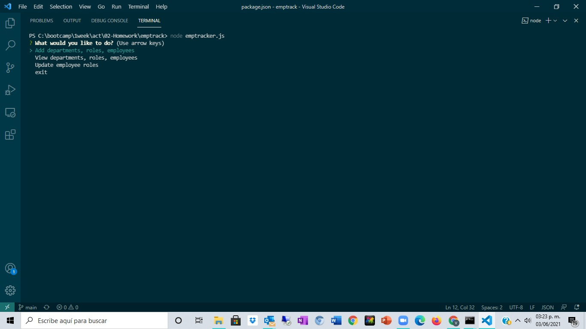
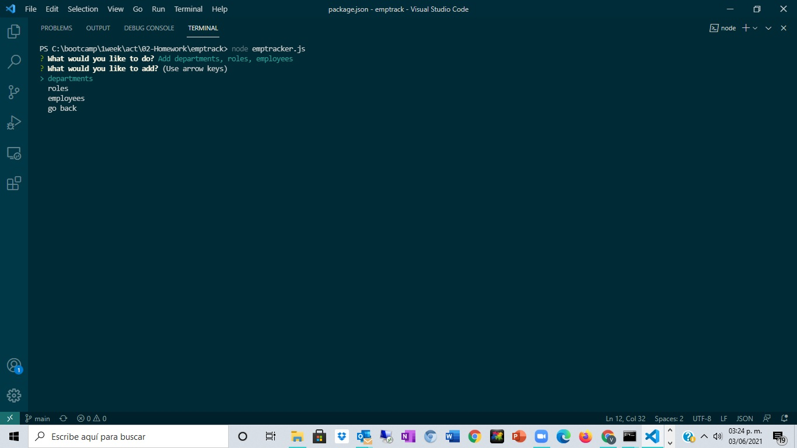
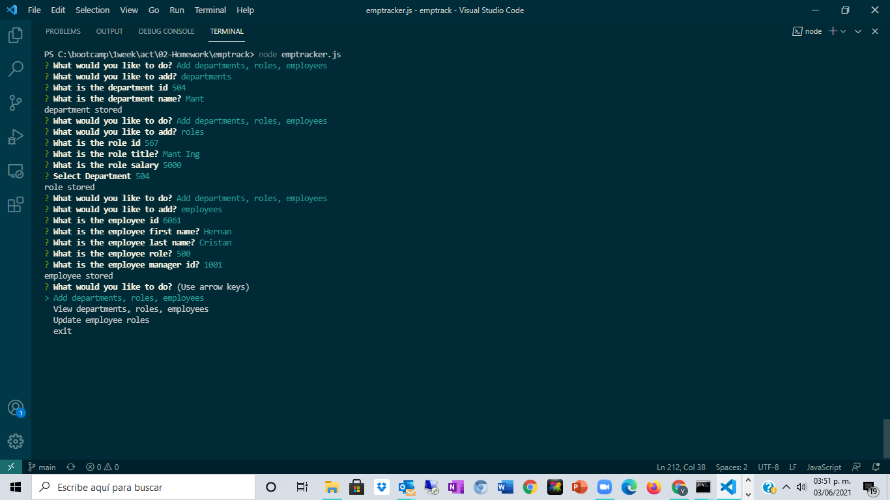
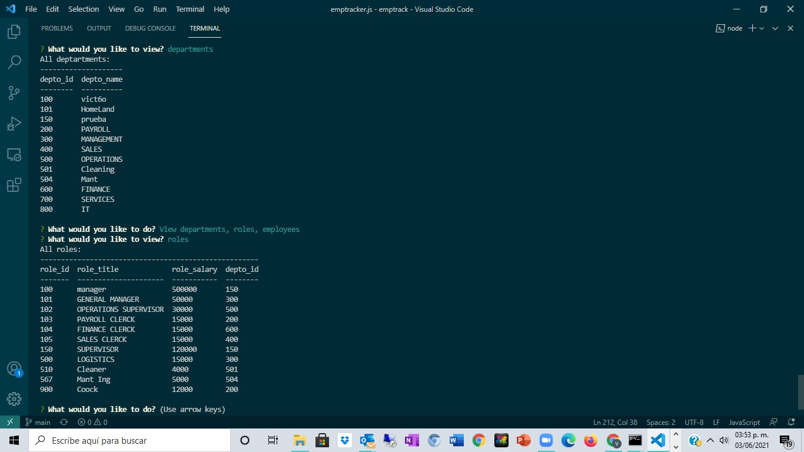
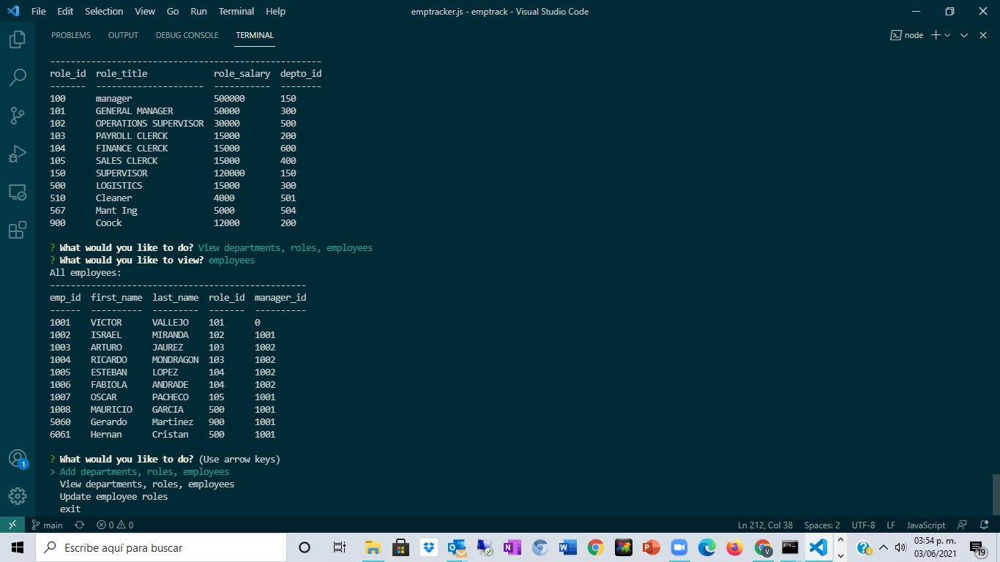
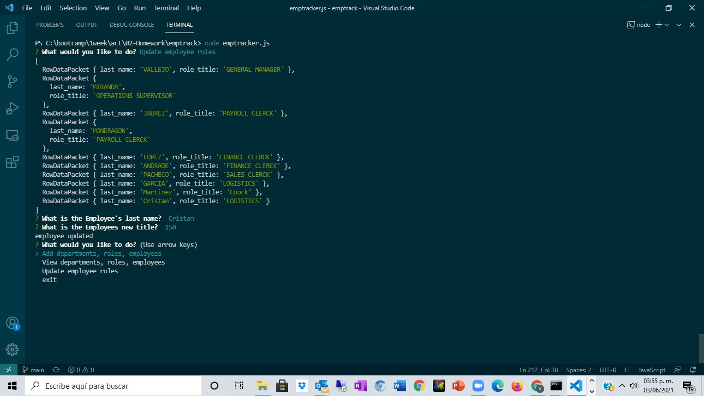

* Employee Tracker App

This app helps you to track your roster and actualice employee roles using a MYSQL database.

It has a main menu that gives you four options:
    

1 ) Add Menu, to add employees, add departments and add roles.

    Example for adding options

2) View menu for consulting tables in the database

3) Udating roles in employees table

4) Exit option